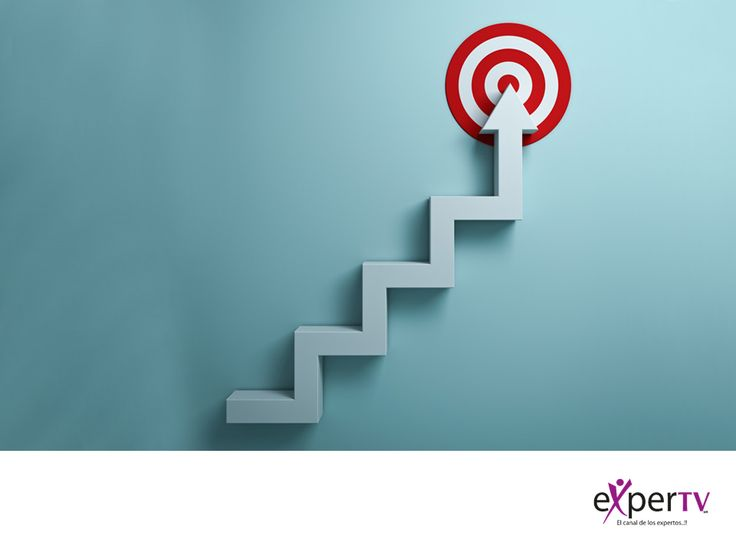

##Мой опыт

Я уже знакома с языком Python и базовыми библиотеками для анализа данных. Больше к сожалению ничего не знаю, но жажду научиться

---

##Мои цели

1.Освоить ключевые алгоритмы машинного обучения (регрессия, классификация, кластеризация).  
2.Научиться работать с библиотеками scikit-learn, PyTorch или TensorFlow.  
3.Реализовать итоговый проект по машинному обучению с полным анализом данных и визуализацией результатов.  

##Задачи на семестр

-Создайте окружение Python и все необходимые библиотеки для ML.  
-Повторить линейную алгебру и основы возможностей, необходимые для понимания алгоритмов.  
-Реализовать простые модели (линейную и логистическую регрессию) на примерах датасетов.  
-Освоить методы предобработки данных (масштабирование, кодирование категориальных признаков, нормализация).  
-Работать с датасетами из sklearn.datasets и Kaggle.  
-Научиться оценивать качество моделей (метрики Accuracy, Precision, Recall, F1, MSE и др.).  
-Сравнить несколько алгоритмов с одним набором данных.  
-Подготовить итоговый проект: выбрать набор дат, построить модель, оформить код и документацию.  

---

  
